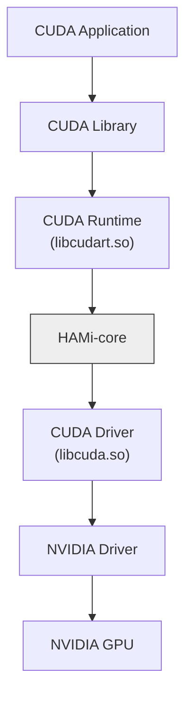

# HAMi-core: CUDA 环境的 Hook 库

[](https://github.com/Project-HAMi/HAMi-core/actions/workflows/build-src.yml)
[](https://github.com/Project-HAMi/HAMi-core/actions/workflows/style.yaml)

[English](README.md) | 中文 | [日本語](README_JA.md)

## 介绍

HAMi-core 是一个容器内的 GPU 资源控制器，在不修改应用或驱动的前提下，通过拦截 CUDA 调用来实现按容器的设备显存限制和算力限制。已被 [HAMi](https://github.com/Project-HAMi/HAMi) 和 [volcano](https://github.com/volcano-sh/devices) 等项目采用。关于 HAMi 整体架构以及 HAMi-core 在其中的位置，请参阅 [HAMi 项目](https://github.com/Project-HAMi/HAMi)。

## 特性

HAMi-core 具有以下特性：
1. GPU 显存虚拟化
2. 通过自实现的时间片方式限制设备利用率
3. 实时设备利用率监控


## 设计原理

HAMi-core 通过劫持 CUDA-Runtime(libcudart.so) 和 CUDA-Driver(libcuda.so) 之间的 API 调用来实现功能，如下图所示：



## 快速开始

### 环境依赖

- CMake >= 2.8.12
- 可用的 CUDA 工具链（`CUDA_HOME`，默认 `/usr/local/cuda`）
- 如需容器化编译，还需要 Docker

### 在Docker中编译

```bash
make build-in-docker
```

### 本地编译

```bash
./build.sh
```

编译产物 `libvgpu.so` 会写入 `build/` 目录。

## 使用方法

_CUDA_DEVICE_MEMORY_LIMIT_ 用于指定设备内存的上限（例如：1g、1024m、1048576k、1073741824）

_CUDA_DEVICE_SM_LIMIT_ 用于指定每个设备的 SM 利用率百分比

```bash
# 为挂载的设备添加 1GiB 内存限制并将最大 SM 利用率设置为 50%
export LD_PRELOAD=./libvgpu.so
export CUDA_DEVICE_MEMORY_LIMIT=1g
export CUDA_DEVICE_SM_LIMIT=50
```

## Docker镜像使用

```bash
# 构建 Docker 镜像
docker build . -f=dockerfiles/Dockerfile -t cuda_vmem:tf1.8-cu90

# 配置容器的 GPU 设备和库挂载选项
export DEVICE_MOUNTS="--device /dev/nvidia0:/dev/nvidia0 --device /dev/nvidia-uvm:/dev/nvidia-uvm --device /dev/nvidiactl:/dev/nvidiactl"
export LIBRARY_MOUNTS="-v /usr/cuda_files:/usr/cuda_files -v $(which nvidia-smi):/bin/nvidia-smi"

# 运行容器并查看 nvidia-smi 输出
docker run ${LIBRARY_MOUNTS} ${DEVICE_MOUNTS} -it \
    -e CUDA_DEVICE_MEMORY_LIMIT=2g \
    -e LD_PRELOAD=/libvgpu/build/libvgpu.so \
    cuda_vmem:tf1.8-cu90 \
    nvidia-smi
```

运行后，您将看到类似以下的 nvidia-smi 输出，显示内存被限制在 2GiB：

```
...
[HAMI-core Msg(1:140235494377280:libvgpu.c:836)]: Initializing.....
Mon Dec  2 04:38:12 2024
+-----------------------------------------------------------------------------------------+
| NVIDIA-SMI 550.107.02             Driver Version: 550.107.02     CUDA Version: 12.4     |
|-----------------------------------------+------------------------+----------------------+
| GPU  Name                 Persistence-M | Bus-Id          Disp.A | Volatile Uncorr. ECC |
| Fan  Temp   Perf          Pwr:Usage/Cap |           Memory-Usage | GPU-Util  Compute M. |
|                                         |                        |               MIG M. |
|=========================================+========================+======================|
|   0  NVIDIA GeForce RTX 3060        Off |   00000000:03:00.0 Off |                  N/A |
| 30%   36C    P8              7W /  170W |       0MiB /   2048MiB |      0%      Default |
|                                         |                        |                  N/A |
+-----------------------------------------+------------------------+----------------------+

+-----------------------------------------------------------------------------------------+
| Processes:                                                                              |
|  GPU   GI   CI        PID   Type   Process name                              GPU Memory |
|        ID   ID                                                               Usage      |
|=========================================================================================|
+-----------------------------------------------------------------------------------------+
[HAMI-core Msg(1:140235494377280:multiprocess_memory_limit.c:497)]: Calling exit handler 1
```

## 日志级别

使用环境变量 LIBCUDA_LOG_LEVEL 来设置日志的可见性

| LIBCUDA_LOG_LEVEL | 描述 |
| ----------------- | ----------- |
|  0          | 仅错误信息 |
|  1(默认),2   | 错误、警告和消息 |
|  3          | 信息、错误、警告和消息 |
|  4          | 调试、错误、警告和消息 |

## 测试原始API

```bash
./test/test_alloc
```

## 参与贡献

欢迎参与贡献。提交 Pull Request 前，请先阅读 [CONTRIBUTING.md](CONTRIBUTING.md)（英文）了解贡献流程、行为准则和代码审查要求。
