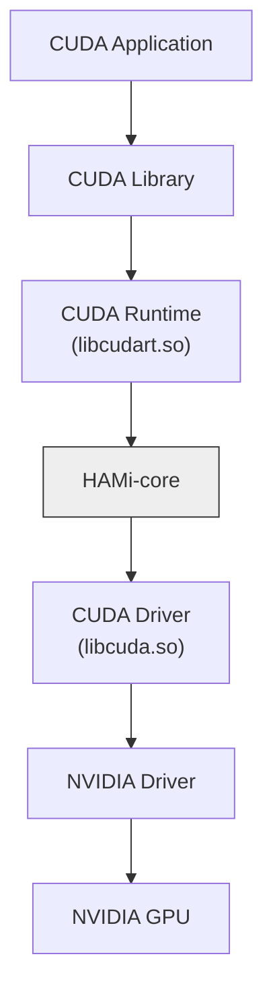

# HAMi-core: CUDA環境向けフックライブラリ

[](https://github.com/Project-HAMi/HAMi-core/actions/workflows/build-src.yml)
[](https://github.com/Project-HAMi/HAMi-core/actions/workflows/style.yaml)

[English](README.md) | [中文](README_CN.md) | 日本語

## はじめに

HAMi-coreはコンテナ内GPUリソースコントローラーです。アプリケーションやドライバーを変更することなく、CUDA呼び出しをフックしてコンテナ単位のデバイスメモリ制限と使用率制限を実現します。[HAMi](https://github.com/Project-HAMi/HAMi)や[volcano](https://github.com/volcano-sh/devices)で採用されています。HAMi全体のアーキテクチャとその中でのHAMi-coreの位置づけについては、[HAMiプロジェクト](https://github.com/Project-HAMi/HAMi)を参照してください。

## 機能

HAMi-coreには以下の機能があります：
1. デバイスメモリの仮想化
2. 自己実装のタイムシェアリングによるデバイス使用率の制限
3. リアルタイムデバイス使用率モニタリング


## 設計

HAMi-coreは、以下の図のようにCUDAランタイム(libcudart.so)とCUDAドライバー(libcuda.so)間のAPI呼び出しをフックすることで動作します：



## はじめ方

### 前提条件

- CMake >= 2.8.12
- 有効なCUDAツールチェーン（`CUDA_HOME`、デフォルトは`/usr/local/cuda`）
- コンテナ化ビルドを行う場合はDockerも必要

### Dockerでのビルド

```bash
make build-in-docker
```

### ローカルビルド

```bash
./build.sh
```

ビルド成果物`libvgpu.so`は`build/`ディレクトリに出力されます。

## 使用方法

_CUDA_DEVICE_MEMORY_LIMIT_ はデバイスメモリの上限を指定します（例：1g、1024m、1048576k、1073741824）

_CUDA_DEVICE_SM_LIMIT_ は各デバイスのSM使用率のパーセンテージを指定します

```bash
# すべてのデバイスに対して1GiBのメモリ制限を追加し、最大SM使用率を50%に設定
export LD_PRELOAD=./libvgpu.so
export CUDA_DEVICE_MEMORY_LIMIT=1g
export CUDA_DEVICE_SM_LIMIT=50
```

CUDAアプリケーションをローカルで実行する場合は、まずローカルディレクトリを作成してください。

```
mkdir /tmp/vgpulock/
```

`CUDA_DEVICE_MEMORY_LIMIT`または`CUDA_DEVICE_SM_LIMIT`を更新した場合は、ローカルキャッシュファイルを削除してください。

```
rm /tmp/cudevshr.cache
```

## Dockerイメージ

```bash
# Dockerイメージのビルド
docker build . -f=dockerfiles/Dockerfile -t cuda_vmem:tf1.8-cu90

# コンテナ用のGPUデバイスとライブラリマウントの設定
export DEVICE_MOUNTS="--device /dev/nvidia0:/dev/nvidia0 --device /dev/nvidia-uvm:/dev/nvidia-uvm --device /dev/nvidiactl:/dev/nvidiactl"
export LIBRARY_MOUNTS="-v /usr/cuda_files:/usr/cuda_files -v $(which nvidia-smi):/bin/nvidia-smi"

# コンテナを実行してnvidia-smiの出力を確認
docker run ${LIBRARY_MOUNTS} ${DEVICE_MOUNTS} -it \
    -e CUDA_DEVICE_MEMORY_LIMIT=2g \
    -e LD_PRELOAD=/libvgpu/build/libvgpu.so \
    cuda_vmem:tf1.8-cu90 \
    nvidia-smi
```

実行後、以下のようなnvidia-smiの出力が表示され、メモリが2GiBに制限されていることが確認できます：

```
...
[HAMI-core Msg(1:140235494377280:libvgpu.c:836)]: Initializing.....
Mon Dec  2 04:38:12 2024
+-----------------------------------------------------------------------------------------+
| NVIDIA-SMI 550.107.02             Driver Version: 550.107.02     CUDA Version: 12.4     |
|-----------------------------------------+------------------------+----------------------+
| GPU  Name                 Persistence-M | Bus-Id          Disp.A | Volatile Uncorr. ECC |
| Fan  Temp   Perf          Pwr:Usage/Cap |           Memory-Usage | GPU-Util  Compute M. |
|                                         |                        |               MIG M. |
|=========================================+========================+======================|
|   0  NVIDIA GeForce RTX 3060        Off |   00000000:03:00.0 Off |                  N/A |
| 30%   36C    P8              7W /  170W |       0MiB /   2048MiB |      0%      Default |
|                                         |                        |                  N/A |
+-----------------------------------------+------------------------+----------------------+

+-----------------------------------------------------------------------------------------+
| Processes:                                                                              |
|  GPU   GI   CI        PID   Type   Process name                              GPU Memory |
|        ID   ID                                                               Usage      |
|=========================================================================================|
+-----------------------------------------------------------------------------------------+
[HAMI-core Msg(1:140235494377280:multiprocess_memory_limit.c:497)]: Calling exit handler 1
```

## ログ

環境変数LIBCUDA_LOG_LEVELを使用してログの表示レベルを設定します

| LIBCUDA_LOG_LEVEL | 説明 |
| ----------------- | ----------- |
|  0          | エラーのみ |
|  1(デフォルト),2          | エラー、警告、メッセージ |
|  3                | 情報、エラー、警告、メッセージ |
|  4                | デバッグ、エラー、警告、メッセージ |

## Raw APIのテスト

```bash
./test/test_alloc
```

## コントリビューション

コントリビューションを歓迎します。プルリクエストを送る前に、貢献の流れや行動規範、レビュー方針について[CONTRIBUTING.md](CONTRIBUTING.md)（英語）をご確認ください。
